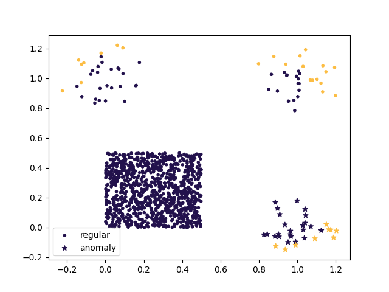
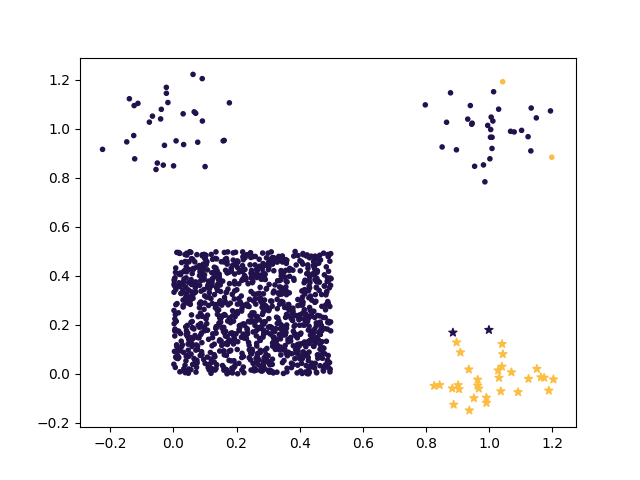

Tutorial
========

Installation
------------

**tl;dr:** ``python3 -mpip install coniferest``

You usually want to create virtual environment first, for example with ``venv``:

.. code-block:: bash

    python3 -mvenv venv
    source venv/bin/activate

We need up-to-date pip:

.. code-block:: bash

    python3 -mpip install -U pip

Finally, install ``coniferest``:

.. code-block:: bash

    python3 -mpip install coniferest

For any problems, please `file an issue on the GitHub <https://github.com/snad-space/coniferest/issues>`_.

Example: non-active anomaly detection
-------------------------------------

Let's generate a simple 2-D dataset with a single outlier as a last object, and run :class:`IsolationForest <coniferest.isoforest.IsolationForest>` model (see `Liu et al. 2008 <https://doi.org/10.1109/ICDM.2008.17>`_) on it:

.. code-block:: python

        from coniferest.datasets import single_outlier
        from coniferest.isoforest import IsolationForest

        data, _metadata = single_outlier(10_000)
        model = IsolationForest(random_seed=0)
        model.fit(data)
        scores = model.score_samples(data)
        print("Index of the outlier:", scores.argmin())

Example: ZTF light curves of M31 field
--------------------------------------

Let's use built-in dataset of ZTF light curve features adopted from `Malanchev at al. (2021) <https://ui.adsabs.harvard.edu/abs/2021MNRAS.502.5147M/abstract>`_:

.. code-block:: python

        from coniferest.datasets import ztf_m31

        data, metadata = ztf_m31()
        print(data.shape)

Here ``data`` is 2-D feature dataset (first axis is for objects, second is for features) and ``metadata`` is 1-D array of ZTF DR object IDs.
Next we need a active anomaly detection model to find outliers in this dataset.
We will use :class:`PineForest <coniferest.pineforest.PineForest>` model developed by the `SNAD <https://snad.space>`_ team.
It is based on Isolation forest model and uses a tree filtering algorithm to learn from the decisions made by the user:

.. code-block:: python

        from coniferest.pineforest import PineForest

        model = PineForest(
            # Number of trees to use for predictions
            n_trees=256,
            # Number of new tree to grow for each decision
            n_spare_trees=768,
            # Fix random seed for reproducibility
            random_seed=0,
        )

Now we are ready to run active anomaly detection :class:`Session <coniferest.session.Session>`:

.. code-block:: python

        from coniferest.session import Session
        from coniferest.session.callback import (
            TerminateAfter, viewer_decision_callback,
        )

        session = Session(
            data=data,
            metadata=metadata,
            model=model,
            # Prompt for a decision and open object's page on the SNAD Viewer
            decision_callback=viewer_decision_callback,
            on_decision_callbacks=[
                # Terminate session after 10 decisions
                TerminateAfter(10),
            ],
        )
        session.run()

This will prompt you to make a decision for an object with the highest outlier score and show you this object in the browser.
Each decision you make retrains the model and updates the outlier scores.
After 10 decisions the session will be terminated, but you can also stop it by pressing ``Ctrl+C``.
Please note that :class:`Session <coniferest.session.Session>` mutates the model, so you should re-create the model if you want to start a new session with the blank model.

For the first candidate you should get a recurrent variable `ZTF DR 695211200075348 <https://ztf.snad.space/dr3/view/695211200075348>`_ / `M31N 2013-11b <https://www.astronomerstelegram.org/?read=5569>`_ / `MASTER OTJ004126.22+414350.0 <https://ui.adsabs.harvard.edu/abs/2016ATel.9470....1S/abstract>`_.
SNAD team reported this object as an anomaly in `Malanchev at al. (2021) <https://ui.adsabs.harvard.edu/abs/2021MNRAS.502.5147M/abstract>`_, it is believed to be a recurrent Nova or `a long-period variable star <https://www.astronomerstelegram.org/?read=5640>`_.
If you are interested in this type of object, say Y otherwise mark it as not-interesting by replying N and continue your investigations — the objects shown to you will depend on the sequence of your replies.

After the session is finished you can explore :class:`Session <coniferest.session.Session>` objects for the decisions you made and final state of the model:

.. code-block:: python

        from pprint import pprint

        print('Decisions:')
        pprint({metadata[idx]: label.name for idx, label in session.known_labels.items()})
        print('Final scores:')
        pprint({metadata[idx]: session.scores[idx] for idx in session.known_labels})

``coniferest`` also provides "Active Anomaly Detection" model based on Isolation forest :class:`AADForest <coniferest.aadforest.AADForest>` model (see `Das et al., 2017 <https://arxiv.org/abs/1708.09441>`_ and `Ishida et al., 2021 <https://ui.adsabs.harvard.edu/abs/2021A%26A...650A.195I/abstract>`_ for details).
You can use it instead of :class:`PineForest <coniferest.pineforest.PineForest>` model in the example above:

.. code-block:: python

        from coniferest.aadforest import AADForest

        model = AADForest(
            # Use 1024 trees, a trade-off between speed and accuracy
            n_trees=1024,
            # Fix random seed for reproducibility
            random_seed=0,
        )

Use your own data
-----------------

In examples above we used built-in datasets, but you can easily use your own data.
The only requirement is that your data should be a 2-D array of features, where first axis is for objects and second is for features.
You also need an 1-D array of object metadata, which can be anything you want, but typically you would make it to be object IDs or names.

Let's generate a simple 2-D dataset and run :class:`PineForest <coniferest.pineforest.PineForest>` model on it using a simple interactive prompt as a decision callback:

.. code-block:: python

        import numpy as np
        from coniferest.pineforest import PineForest
        from coniferest.session import Session
        from coniferest.session.callback import (
            TerminateAfter, prompt_decision_callback,
        )

        n_objects = 1000
        n_features = 10

        rng = np.random.default_rng(0)
        data = rng.normal(size=(n_objects, n_features))
        # prompt_decision_callback will print object's metadata, so it should
        # have a pretty representation. Integer index is good for this example
        metadata = np.arange(n_objects)

        session = Session(
            data=data,
            metadata=metadata,
            model=PineForest(random_seed=0),
            decision_callback=prompt_decision_callback,
            on_decision_callbacks=TerminateAfter(10),
        )
        session.run()

Session life cycle
------------------

Examples above use :class:`Session <coniferest.session.Session>` class to run active anomaly detection.
Let's take a closer look at how it works, please refer to :class:`Session <coniferest.session.Session>` API documentation for more details on the class constructor arguments and the class methods and attributes.

1. Initialize session with :class:`Session() <coniferest.session.Session>` constructor
2. Call :meth:`Session.run() <coniferest.session.Session.run>` method to start the session. It will do the following:

    a) Session initializes the model (calls :meth:`.fit() <coniferest.coniferest.Coniferest.fit>` on it) with the `data`
    b) The decision loop starts and last until session is terminated or all data points are labeled:

        i) :attr:`model <coniferest.session.Session.model>` is fit for current :attr:`Session.known_labels <coniferest.session.Session.known_labels>` (calls :meth:`.fit_known() <coniferest.coniferest.Coniferest.fit_known>` on it)
        ii) ``on_refit_callbacks`` are called
        iii) If all data points are labeled, the session is terminated
        iv) ``decision_callback`` is called, the decision is stored in :attr:`Session.known_labels <coniferest.session.Session.known_labels>`
        v) ``on_decision_callbacks`` are called
        vi) If session was terminated in one of the callbacks, then the decision loop is terminated. Otherwise, go to step i)

3. Inspect :class:`Session() <coniferest.session.Session>` object attributes like :attr:`known_labels <coniferest.session.Session.known_labels>`, :attr:`scores <coniferest.session.Session.scores>` and :attr:`model <coniferest.session.Session.model>` to get the results of the session

Note that :class:`Session <coniferest.session.Session>` mutates input model, so if you use the same model object again for a new session, it will continue from the previous model state.

Tune the Session with callbacks
-------------------------------

Now we know how :class:`Session <coniferest.session.Session>` works, but how can we change its behavior?
The answer is callbacks.
Callbacks are functions that are called at different stages of the session lifecycle.
Let's implement a simple callback per each stage:

.. code-block:: python

        from coniferest.pineforest import PineForest
        from coniferest.label import Label
        from coniferest.session import Session

        def my_on_refit_callback(session):
            print('Refitting model with known labels:')
            print(session.known_labels)

        def my_decision_callback(metadata, data, session):
            """Say YES when the first feature is positive"""
            print(f'Labeling object {metadata}')
            return Label.ANOMALY if data[0] > 0.0 else Label.REGULAR

        def my_on_decision_callback(metadata, data, session):
            print(f'Decision made for {metadata}: {session.last_decision}.')

        def terminate_after_5_anomalies(metadata, data, session):
            if session.known_anomalies.size >= 5:
                session.terminate()

        class RecordCallback:
            def __init__(self):
                self.records = []

            def __call__(self, metadata, data, session):
                self.records.append(f'{metadata} -> {session.last_decision}')

            def print_report(self):
                print('Records:')
                print('\n'.join(self.records))

        record_callback = RecordCallback()

        rng = np.random.default_rng(0)
        data = rng.normal(size=(1000, 2))
        metadata = np.arange(data.shape[0])
        model = PineForest(random_seed=0)

        session = Session(
            data=data,
            metadata=metadata,
            model=model,
            decision_callback=my_decision_callback,
            # We can give an only function/callable as a callback
            on_refit_callbacks=my_on_refit_callback,
            # Or a list of callables
            on_decision_callbacks=[
                my_on_decision_callback,
                record_callback,
                terminate_after_5_anomalies,
            ],
        )
        session.run()

        print()
        record_callback.print_report()

Use prior knowledge with known labels
-------------------------------------

The final component of the :class:<Session <coniferest.session.Session>> constructor we haven't discussed yet is ``known_labels``.
It allows you to provide prior knowledge about few samples in the dataset.
This is useful when you know that some samples are anomalies or regular objects, so you can find more objects you like or get less false positives.

Let's use a simulated dataset with 1024 regular objects and three "outlier" classes, each with 32 objects.
Within these three classes, only one considered as anomalous, while other two are some kind of "bogus" objects that we don't want to find.

.. code-block:: python

        # Install matplotlib if you don't have it
        import matplotlib.pyplot as plt
        from coniferest.datasets import non_anomalous_outliers
        from coniferest.label import Label

        data, metadata = non_anomalous_outliers(
            # Number of regular objects
            inliers=1024,
            # Number of objects per "outlier" class
            outliers=32,
            # Classification of "outlier" classes
            regions=[Label.R, Label.R, Label.A],
        )

        # Plot the data
        index = metadata == Label.R
        plt.scatter(*data[index, :].T, marker='.', color='#22114C', label='regular')
        plt.scatter(*data[~index, :].T, marker='*', color='#22114C', label='anomaly')
        plt.legend()
        plt.show()

.. image:: _static/tutorial/known_labels_dataset.png

Let's see what :class:`IsolationForest <coniferest.isolationforest.IsolationForest>` will find in this dataset within top-32 outliers:

.. code-block:: python

        from coniferest.isoforest import IsolationForest

        scores = IsolationForest(random_seed=0).fit(data).score_samples(data)
        top32 = scores.argsort()[:32]

        color = np.full_like(metadata, '#22114C', dtype=object)
        color[top32] = '#FCBD43'

        plt.cla()
        plt.scatter(*data[index, :].T, marker='.', color=color[index], label='regular')
        plt.scatter(*data[~index, :].T, marker='*', color=color[~index], label='anomaly')
        plt.legend()
        plt.show()

Here we show 32 candidates in "SNAD yellow" color.
Not bad, but what can we do with the active anomaly detection?

.. code-block:: python

        from coniferest.pineforest import PineForest
        from coniferest.session import Session
        from coniferest.session.callback import TerminateAfter

        session = Session(
            data,
            metadata,
            model=PineForest(random_seed=0),
            # metadata consists of true labels, so we can use it as a decision
            decision_callback=lambda metadata, data, session: metadata,
            on_decision_callbacks=TerminateAfter(32),
        )
        session.run()

        color = np.full_like(metadata, '#22114C', dtype=object)
        color[list(session.known_labels)] = '#FCBD43'

        plt.cla()
        plt.scatter(*data[index, :].T, marker='.', color=color[index], label='regular')
        plt.scatter(*data[~index, :].T, marker='*', color=color[~index], label='anomaly')
        plt.show()

.. image:: _static/tutorial/known_labels_pineforest.png

Looks good, right?
But what if we know that one of the "outlier" objects is not an anomaly?
Let's suppose that before doing the active anomaly detection we investigated the most-left object and found that it is a bogus object.
We can mark it as a regular object and run the active anomaly detection again:

.. code-block:: python

        from coniferest.pineforest import PineForest
        from coniferest.session import Session
        from coniferest.session.callback import TerminateAfter

        # Key is index of the object, value is its label.
        known_labels = {data[:, 0].argmin(): Label.REGULAR}

        session = Session(
            data,
            metadata,
            known_labels=known_labels,
            model=PineForest(random_seed=0),
            decision_callback=lambda metadata, data, session: metadata,
            on_decision_callbacks=TerminateAfter(32),
        )
        session.run()

        color = np.full_like(metadata, '#22114C', dtype=object)
        new_labels = set(session.known_labels) - set(known_labels)
        color[list(new_labels)] = '#FCBD43'

        plt.cla()
        plt.scatter(*data[index, :].T, marker='.', color=color[index], label='regular')
        plt.scatter(*data[~index, :].T, marker='*', color=color[~index], label='anomaly')
        plt.show()

Note that the object we marked as regular was not even selected by the previous run, but here it influenced the model to not select other objects of this class.
